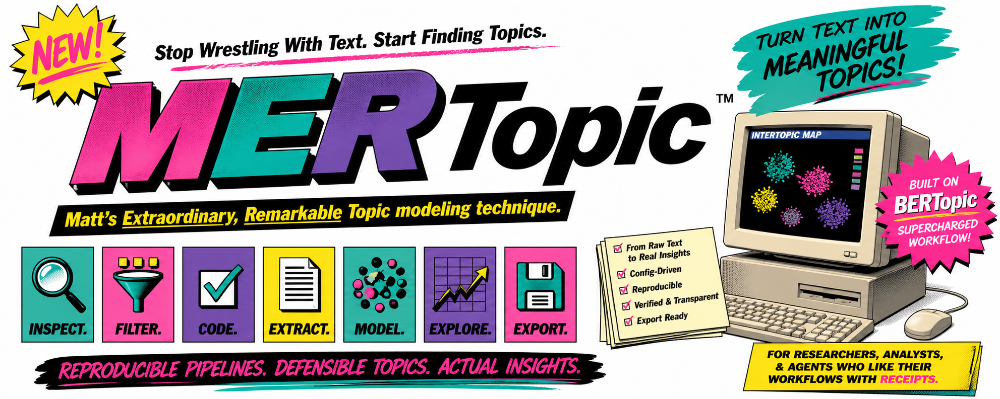

# MERTopic

Matt's Extraordinary, Remarkable Topic modeling technique. Yes, the acronym is doing a lot of work. Fortunately, the workflow does too.



MERTopic is a reusable coding-agent skill for building config-driven text topic modeling pipelines. It is based on BERTopic and wraps the surrounding research workflow that BERTopic alone does not magically solve: dataset inspection, optional keyword filtering, LLM relevancy coding, verified extractive span creation, embeddings, topic modeling at bullet or post level, parameter grid search, intertopic maps, co-occurrence tables, and exports for downstream browsing or analysis tools.

This is not a joke skill. It is a practical workflow with a little dry personality, because reproducibility is easier to tolerate when the instructions are not embalmed.

## What It Does

MERTopic helps an agent create a full analysis project around a text dataset:

- inspect files and identify likely ID, title, body, and metadata fields;
- clarify the research goal and unit of analysis;
- scaffold a reproducible project with `.env`, `scripts/`, `data/`, and a project README;
- stop at major decision points before API-costing stages unless you explicitly authorize a run;
- optionally create a recall-oriented keyword filter;
- optionally run LLM relevancy coding for a narrower analytic subset;
- extract verbatim spans or bullets and verify them against the source text;
- create embeddings for spans, bullets, and post-level summaries;
- run BERTopic at bullet level, post level, or both;
- run broad and focused grid searches when model parameters need justification;
- save topic assignments, topic summaries, intertopic maps, and co-occurrence outputs;
- export one-record-per-post JSON for downstream qualitative browsing tools.

The basic philosophy is simple: save intermediate artifacts, keep choices configurable, verify what can be verified, and do not pretend coherence alone has been ordained by the universe as the final judge of topic quality.

## Folder Structure

```text
MERTopic/
├── SKILL.md
├── README.md
├── agents/
│   └── openai.yaml
├── assets/
│   └── mertopic-banner.png
├── config_template.env.example
├── subskills/
│   ├── 01_discovery_and_scoping/
│   ├── 02_project_scaffolding/
│   ├── 03_keyword_filtering/
│   ├── 04_relevancy_coding/
│   ├── 05_span_extraction_and_verification/
│   ├── 06_embeddings/
│   ├── 07_topic_modeling/
│   ├── 08_grid_search/
│   └── 09_analysis_tool_exports/
└── templates/
    ├── common_code_patterns.md
    ├── prompt_design_patterns.md
    ├── python_stage_template.py
    └── shell_runner_template.sh
```

`SKILL.md` is the main entry point. The `subskills/` folders break the workflow into stages. The `templates/` folder gives the agent reusable implementation patterns without forcing every future project to reinvent the same little wheel, badly.

## Installation

Place this folder where your coding agent can read it as a skill. For Codex, a typical location is:

```bash
~/.codex/skills/mertopic
```

You can also keep it inside a project and explicitly reference the path when prompting the agent. The important part is that the agent can read `SKILL.md`, the `subskills/` directory, the templates, and your dataset.

## Data Placement

Put your dataset in the same project workspace where the agent will create the pipeline. A simple starting layout is:

```text
your-analysis-project/
├── data/
│   └── raw/
│       └── input.jsonl
└── mertopic/
    ├── SKILL.md
    ├── subskills/
    └── templates/
```

CSV, JSONL, and Parquet are the easiest formats to start with. The agent will inspect the file and ask what each field means if the column names are too cute for their own good.

## How To Prompt Your Agent

Use the skill explicitly in your coding agent, live coding tool, or CLI workflow. Codex, Claude Code, and similar tools are all fine as long as they can read files and run code in your workspace.

Example prompt:

```text
Use $mertopic for this project. My dataset is in data/raw/input.jsonl.
Inspect the data first, ask me the setup questions you need, then scaffold a reproducible topic modeling pipeline. Stop at major decision points and tell me what to run before continuing.
```

If your agent does not support `$skill-name` syntax, reference the path directly:

```text
Use the MERTopic skill at ./mertopic/SKILL.md. My dataset is in data/raw/input.csv.
Inspect the fields, ask the required setup questions, then build the pipeline stage by stage.
```

## What The Agent Should Ask First

After the skill starts, the agent should inspect the dataset and ask only the missing questions, usually:

- What does each row represent?
- Which columns are ID, title, body, timestamp, and metadata?
- What research question or focal construct should the topics serve?
- Do you want a step-by-step plan before code is written?
- Do you need keyword filtering, LLM relevancy coding, or both?
- Should extracted spans be generic summaries or targeted to a construct?
- Should the topic model run on full posts, extracted bullets, or both?
- Do you need a defensible grid search, or is a first-pass model enough?
- Do you need exports for a browsing or co-occurrence analysis tool?

The agent should then build the code, tell you which scripts to run, inspect the outputs, and continue the process until the pipeline is actually finished. A half-built analysis folder is not a workflow; it is a future archaeological site.

The agent should not ask you to paste API keys into chat. It should create or update a local `.env`, leave missing secrets blank, and tell you which variable to fill locally. It should also not substitute LDA, NMF, or another easier local method for BERTopic unless you explicitly request a different algorithm.

## Expected Workflow

1. Discovery and scoping
2. Project scaffolding
3. Optional keyword filtering
4. Optional LLM relevancy coding
5. Extractive span or bullet creation
6. Span verification
7. Embedding generation
8. BERTopic modeling
9. Optional broad and focused grid search
10. Final model selection
11. Analysis-tool export

Each stage should save outputs and stats. If a stage is skipped, the project README should say why.

## Outputs

A complete MERTopic project usually includes:

- `.env` with all paths, model names, prompts, retry counts, seeds, and BERTopic parameters;
- shell runners for each stage;
- Python scripts for filtering, coding, extraction, embedding, modeling, grid search, and export;
- stage-specific output folders under `data/`;
- preview CSVs and stats JSON files;
- topic assignment tables;
- topic summaries and labels;
- `intertopic_distance_map.html`;
- topic co-occurrence tables and optional network HTML;
- final export JSON for external analysis tools.

## Model Selection

MERTopic treats BERTopic as an exploratory mixed-methods step, not a vending machine for truth. Final model selection should balance:

- topic count;
- outlier rate;
- largest-topic share;
- topic diversity;
- coherence;
- cluster separation;
- qualitative inspection of representative documents;
- usefulness for the actual research question.

High coherence with dozens of tiny clusters may be fragmentation wearing a nice hat. Collapsed models with one giant topic are also not impressive just because they finished running.

## Notes For Maintainers

Keep `SKILL.md` concise and procedural. Put longer stage guidance in `subskills/` and reusable patterns in `templates/`. If you add scripts, test them. If you add new required files, update this README and `agents/openai.yaml`.

The skill should stay useful across agents. Avoid instructions that depend on one vendor-specific feature unless there is a fallback.
